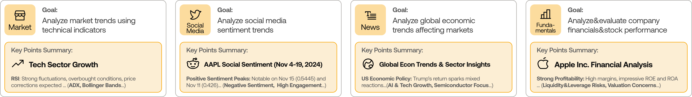
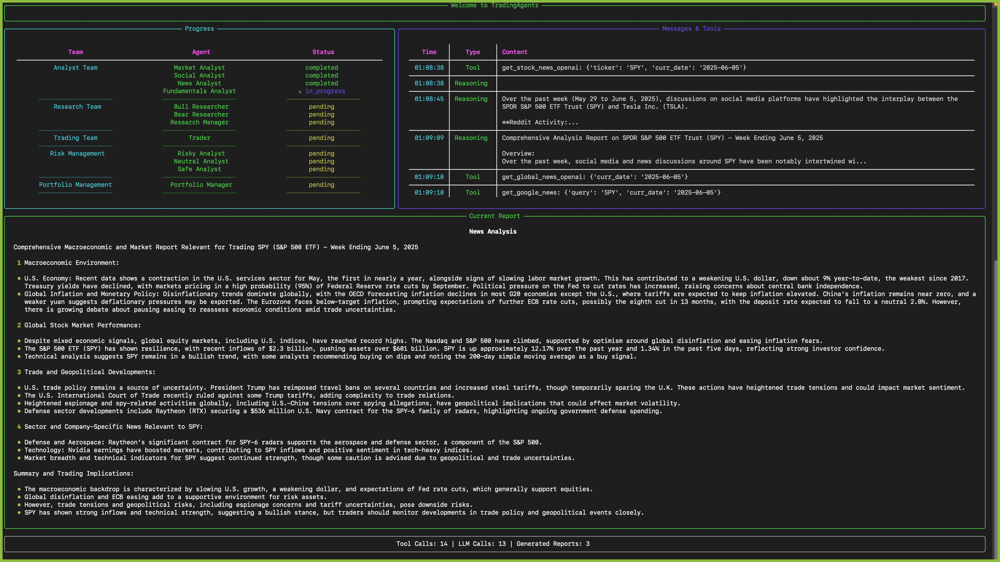
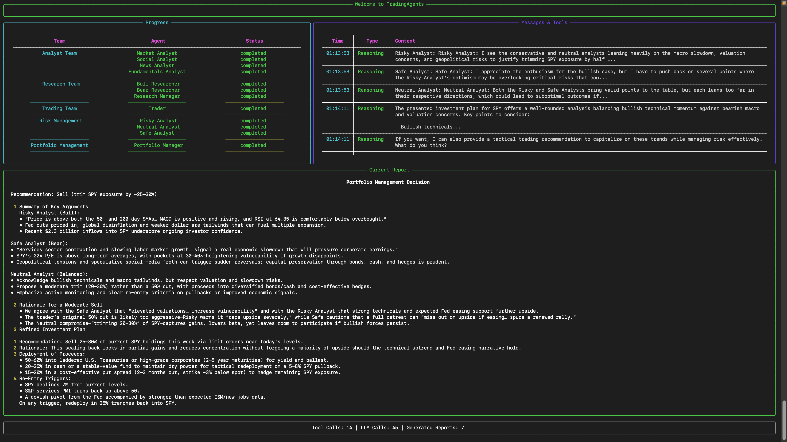

<p align="center">
  
</p>

<div align="center" style="line-height: 1;">
  <a href="https://arxiv.org/abs/2412.20138" target="_blank"></a>
  <a href="https://discord.com/invite/hk9PGKShPK" target="_blank"></a>
  <a href="./assets/wechat.png" target="_blank"></a>
  <a href="https://x.com/TauricResearch" target="_blank"></a>
  <br>
  <a href="https://github.com/TauricResearch/" target="_blank"></a>
</div>

<div align="center">
  <!-- Keep these links. Translations will automatically update with the README. -->
  <a href="https://www.readme-i18n.com/TauricResearch/TradingAgents?lang=de">Deutsch</a> | 
  <a href="https://www.readme-i18n.com/TauricResearch/TradingAgents?lang=es">Español</a> | 
  <a href="https://www.readme-i18n.com/TauricResearch/TradingAgents?lang=fr">français</a> | 
  <a href="https://www.readme-i18n.com/TauricResearch/TradingAgents?lang=ja">日本語</a> | 
  <a href="https://www.readme-i18n.com/TauricResearch/TradingAgents?lang=ko">한국어</a> | 
  <a href="https://www.readme-i18n.com/TauricResearch/TradingAgents?lang=pt">Português</a> | 
  <a href="https://www.readme-i18n.com/TauricResearch/TradingAgents?lang=ru">Русский</a> | 
  <a href="https://www.readme-i18n.com/TauricResearch/TradingAgents?lang=zh">中文</a>
</div>

---

# TradingAgents: Multi-Agents LLM Financial Trading Framework 

> 🎉 **TradingAgents** officially released! We have received numerous inquiries about the work, and we would like to express our thanks for the enthusiasm in our community.
>
> So we decided to fully open-source the framework. Looking forward to building impactful projects with you!

## 🤖 AI Assistant Context

**For AI assistants working on this project**: Please read the [AI_CONTEXT.md](AI_CONTEXT.md) file first to understand the project's current state, deployment status, and configuration details. This file contains essential information about the project's architecture, deployment decisions, and current issues that need addressing.

<div align="center">
<a href="https://www.star-history.com/#TauricResearch/TradingAgents&Date">
 <picture>
   <source media="(prefers-color-scheme: dark)" srcset="https://api.star-history.com/svg?repos=TauricResearch/TradingAgents&type=Date&theme=dark" />
   <source media="(prefers-color-scheme: light)" srcset="https://api.star-history.com/svg?repos=TauricResearch/TradingAgents&type=Date" />
   
 </picture>
</a>
</div>

<div align="center">

🚀 [TradingAgents](#tradingagents-framework) | ⚡ [Installation & CLI](#installation-and-cli) | 🎬 [Demo](https://www.youtube.com/watch?v=90gr5lwjIho) | 📦 [Package Usage](#tradingagents-package) | 🤝 [Contributing](#contributing) | 📄 [Citation](#citation)

</div>

## TradingAgents Framework

TradingAgents is a multi-agent trading framework that mirrors the dynamics of real-world trading firms. By deploying specialized LLM-powered agents: from fundamental analysts, sentiment experts, and technical analysts, to trader, risk management team, the platform collaboratively evaluates market conditions and informs trading decisions. Moreover, these agents engage in dynamic discussions to pinpoint the optimal strategy.

<p align="center">
  
</p>

> TradingAgents framework is designed for research purposes. Trading performance may vary based on many factors, including the chosen backbone language models, model temperature, trading periods, the quality of data, and other non-deterministic factors. [It is not intended as financial, investment, or trading advice.](https://tauric.ai/disclaimer/)

Our framework decomposes complex trading tasks into specialized roles. This ensures the system achieves a robust, scalable approach to market analysis and decision-making.

### Analyst Team
- Fundamentals Analyst: Evaluates company financials and performance metrics, identifying intrinsic values and potential red flags.
- Sentiment Analyst: Analyzes social media and public sentiment using sentiment scoring algorithms to gauge short-term market mood.
- News Analyst: Monitors global news and macroeconomic indicators, interpreting the impact of events on market conditions.
- Technical Analyst: Utilizes technical indicators (like MACD and RSI) to detect trading patterns and forecast price movements.

<p align="center">
  
</p>

### Researcher Team
- Comprises both bullish and bearish researchers who critically assess the insights provided by the Analyst Team. Through structured debates, they balance potential gains against inherent risks.

<p align="center">
  
</p>

### Trader Agent
- Composes reports from the analysts and researchers to make informed trading decisions. It determines the timing and magnitude of trades based on comprehensive market insights.

<p align="center">
  
</p>

### Risk Management and Portfolio Manager
- Continuously evaluates portfolio risk by assessing market volatility, liquidity, and other risk factors. The risk management team evaluates and adjusts trading strategies, providing assessment reports to the Portfolio Manager for final decision.
- The Portfolio Manager approves/rejects the transaction proposal. If approved, the order will be sent to the simulated exchange and executed.

<p align="center">
  
</p>

## Installation and CLI

### Installation

Clone TradingAgents:
```bash
git clone https://github.com/TauricResearch/TradingAgents.git
cd TradingAgents
```

Create a virtual environment in any of your favorite environment managers:
```bash
conda create -n tradingagents python=3.13
conda activate tradingagents
```

Install dependencies:
```bash
pip install -r requirements.txt
```

### Environment Setup

The project uses environment variables for configuration. You can set them up in two ways:

#### Option 1: Automatic Setup (Recommended)
Run the setup script to create your `.env` file:
```bash
python setup_env.py
```

This will prompt you for your OpenAI API key and create a `.env` file with all necessary configuration.

#### Option 2: Manual Setup
Create a `.env` file in the project root with the following content:
```bash
# OpenAI API Configuration
OPENAI_API_KEY=your_openai_api_key_here

# LLM Provider Settings
LLM_PROVIDER=openai
DEEP_THINK_LLM=gpt-4o
QUICK_THINK_LLM=gpt-4o
BACKEND_URL=https://api.openai.com/v1

# Debate and Discussion Settings
MAX_DEBATE_ROUNDS=1
MAX_RISK_DISCUSS_ROUNDS=1
MAX_RECUR_LIMIT=100

# Tool Settings
ONLINE_TOOLS=true

# Data Settings
DATA_DIR=/Users/yluo/Documents/Code/ScAI/FR1-data
```

**Important**: Replace `your_openai_api_key_here` with your actual OpenAI API key.

#### Verify Environment Setup
Check if your environment is configured correctly:
```bash
python setup_env.py check
```

### Required APIs

You will also need the FinnHub API for financial data. All of our code is implemented with the free tier.
```bash
export FINNHUB_API_KEY="d1bkmr9r01qsbpudktsgd1bkmr9r01qsbpudktt0"
```

You will need the OpenAI API for all the agents. The API key is stored in the `.env` file:
```bash
# The OpenAI API key is automatically loaded from .env file
# No need to export manually - it's handled by python-dotenv
```

### CLI Usage

You can also try out the CLI directly by running:
```bash
python -m cli.main
```
You will see a screen where you can select your desired tickers, date, LLMs, research depth, etc.

<p align="center">
  
</p>

An interface will appear showing results as they load, letting you track the agent's progress as it runs.

<p align="center">
  
</p>

<p align="center">
  
</p>

## TradingAgents Package

### Implementation Details

We built TradingAgents with LangGraph to ensure flexibility and modularity. We utilize `o1-preview` and `gpt-4o` as our deep thinking and fast thinking LLMs for our experiments. However, for testing purposes, we recommend you use `o4-mini` and `gpt-4.1-mini` to save on costs as our framework makes **lots of** API calls.

### Python Usage

To use TradingAgents inside your code, you can import the `tradingagents` module and initialize a `TradingAgentsGraph()` object. The `.propagate()` function will return a decision. You can run `main.py`, here's also a quick example:

```python
from tradingagents.graph.trading_graph import TradingAgentsGraph
from tradingagents.default_config import DEFAULT_CONFIG

ta = TradingAgentsGraph(debug=True, config=DEFAULT_CONFIG.copy())

# forward propagate
_, decision = ta.propagate("NVDA", "2024-05-10")
print(decision)
```

You can also adjust the default configuration to set your own choice of LLMs, debate rounds, etc.

```python
from tradingagents.graph.trading_graph import TradingAgentsGraph
from tradingagents.default_config import DEFAULT_CONFIG

# Create a custom config
config = DEFAULT_CONFIG.copy()
config["deep_think_llm"] = "gpt-4o"  # Use a different model
config["quick_think_llm"] = "gpt-4o"  # Use a different model
config["max_debate_rounds"] = 1  # Increase debate rounds
config["online_tools"] = True # Use online tools or cached data

# Initialize with custom config
ta = TradingAgentsGraph(debug=True, config=config)

# forward propagate
_, decision = ta.propagate("NVDA", "2024-05-10")
print(decision)
```

> For `online_tools`, we recommend enabling them for experimentation, as they provide access to real-time data. The agents' offline tools rely on cached data from our **Tauric TradingDB**, a curated dataset we use for backtesting. We're currently in the process of refining this dataset, and we plan to release it soon alongside our upcoming projects. Stay tuned!

You can view the full list of configurations in `tradingagents/default_config.py`.

## Contributing

We welcome contributions from the community! Whether it's fixing a bug, improving documentation, or suggesting a new feature, your input helps make this project better. If you are interested in this line of research, please consider joining our open-source financial AI research community [Tauric Research](https://tauric.ai/).

## Citation

Please reference our work if you find *TradingAgents* provides you with some help :)

```
@misc{xiao2025tradingagentsmultiagentsllmfinancial,
      title={TradingAgents: Multi-Agents LLM Financial Trading Framework}, 
      author={Yijia Xiao and Edward Sun and Di Luo and Wei Wang},
      year={2025},
      eprint={2412.20138},
      archivePrefix={arXiv},
      primaryClass={q-fin.TR},
      url={https://arxiv.org/abs/2412.20138}, 
}
```

## Token Usage Optimization

The system has been optimized to reduce OpenAI API token consumption:

- **Reduced Debate Rounds**: `MAX_DEBATE_ROUNDS=1` and `MAX_RISK_DISCUSS_ROUNDS=1`
- **Limited Analysts**: Only uses "market" and "fundamentals" analysts by default
- **Reduced Recursion**: `MAX_RECUR_LIMIT=50` (down from 100)
- **Streamlined Tools**: Only essential tools for market and fundamental analysis

These optimizations help stay within OpenAI's 16k token limit while maintaining analysis quality.

## Quick Start

### 1. Environment Setup

Run the setup script to configure your environment:

```bash
python setup_env.py
```

This will guide you through creating a `.env` file with your API keys and settings.

### 2. Install Dependencies

```bash
pip install -r requirements.txt
```

### 3. Basic Usage

```python
from tradingagents.graph.trading_graph import TradingAgentsGraph

# Create graph instance (uses token-optimized defaults)
graph = TradingAgentsGraph()

# Run analysis
result = graph.propagate("AAPL", "2024-01-15")
print(result)
```

## Configuration

### Environment Variables

Create a `.env` file with your settings:

```bash
# LLM Provider (openai, anthropic, google)
LLM_PROVIDER=openai

# OpenAI Configuration
OPENAI_API_KEY=your_openai_api_key_here
DEEP_THINK_LLM=gpt-4o
QUICK_THINK_LLM=gpt-4o
BACKEND_URL=https://api.openai.com/v1

# Token Usage Optimization Settings
MAX_DEBATE_ROUNDS=1
MAX_RISK_DISCUSS_ROUNDS=1
MAX_RECUR_LIMIT=50

# Data and Tool Settings
DATA_DIR=/path/to/your/data/directory
ONLINE_TOOLS=true
```

### Custom Configuration

```python
config = {
    "llm_provider": "openai",
    "deep_think_llm": "gpt-4o",
    "quick_think_llm": "gpt-4o",
    "max_debate_rounds": 1,  # Token optimization
    "max_risk_discuss_rounds": 1,  # Token optimization
    "max_recur_limit": 50,  # Token optimization
}

graph = TradingAgentsGraph(config)
```

## API Usage

### FastAPI Server

Start the FastAPI server:

```bash
python app.py
```

### API Endpoints

- `POST /trade`: Submit trading analysis request
- `GET /health`: Health check endpoint

Example request:

```bash
curl -X POST "http://localhost:8000/trade" \
     -H "Content-Type: application/json" \
     -d '{"ticker": "AAPL", "date": "2024-01-15"}'
```

## CLI Usage

Run the command-line interface:

```bash
python cli/main.py
```

Available commands:
- `init`: Initialize the trading system
- `analyze <ticker> <date>`: Run analysis for a specific stock
- `news`: Get latest market news
- `technical`: Get technical analysis

## Architecture

### Agent Types

1. **Researchers**: Bull and Bear researchers analyze market sentiment
2. **Analysts**: Market, fundamentals, news, and social media analysts
3. **Risk Managers**: Conservative, neutral, and aggressive risk debaters
4. **Trader**: Final decision maker based on all analyses

### Data Flow

1. **Data Collection**: Market data, fundamentals, news, social sentiment
2. **Analysis**: Multi-agent analysis and debate
3. **Risk Assessment**: Multi-level risk evaluation
4. **Decision Making**: Final trading recommendation

## Development

### Project Structure

```
tradingagents/
├── agents/           # Agent implementations
├── dataflows/        # Data collection and processing
├── graph/           # Graph execution logic
└── default_config.py # Default configuration
```

### Testing

Run the test suite:

```bash
python test_trading_agents_graph.py
python test_env_setup.py
```

## License

This project is licensed under the MIT License - see the [LICENSE](LICENSE) file for details.

## Contributing

1. Fork the repository
2. Create a feature branch
3. Make your changes
4. Add tests
5. Submit a pull request

## Support

For issues and questions, please check the documentation or create an issue in the repository.
